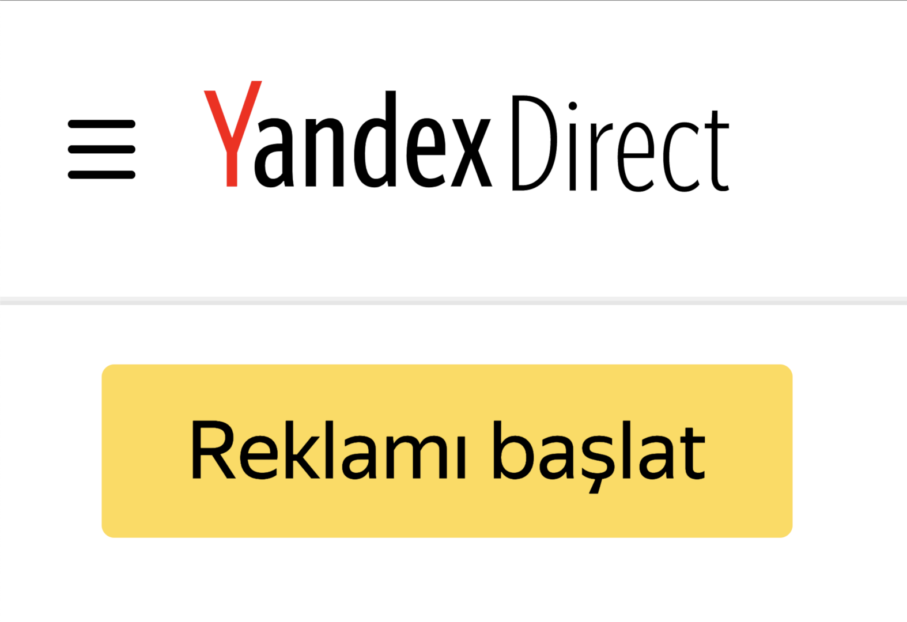
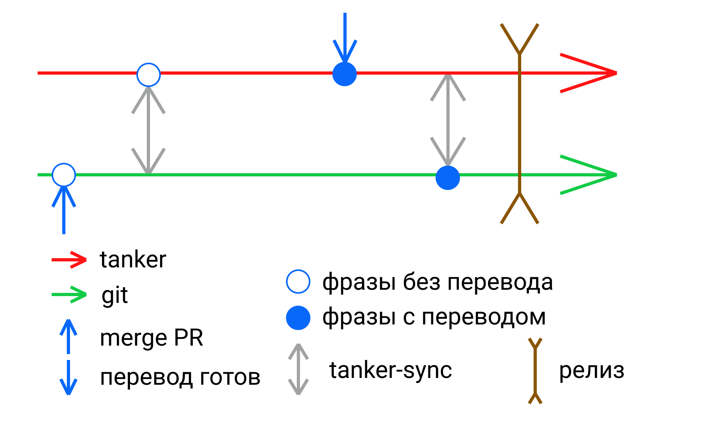
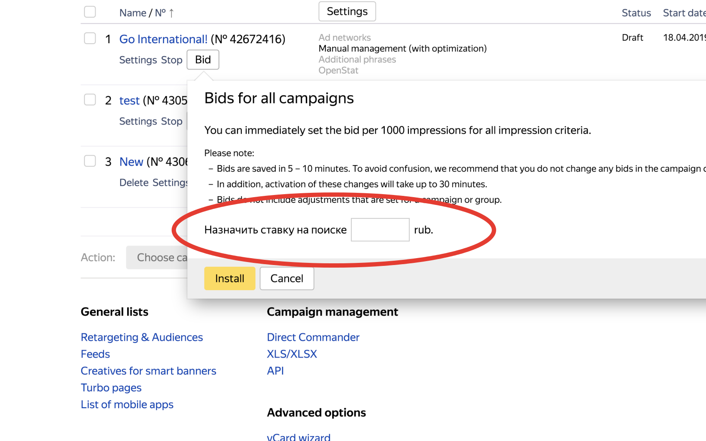
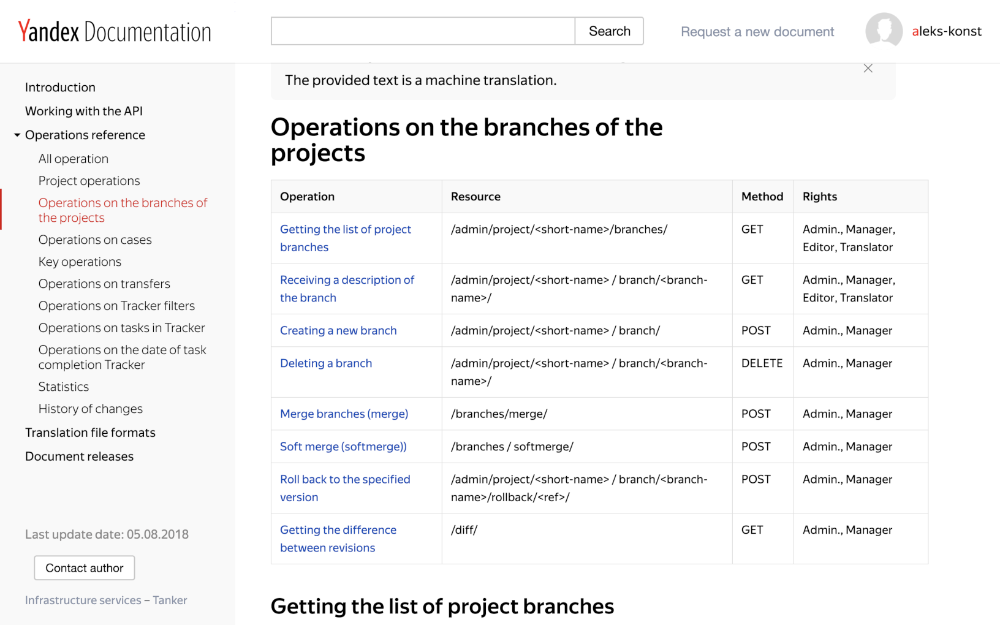
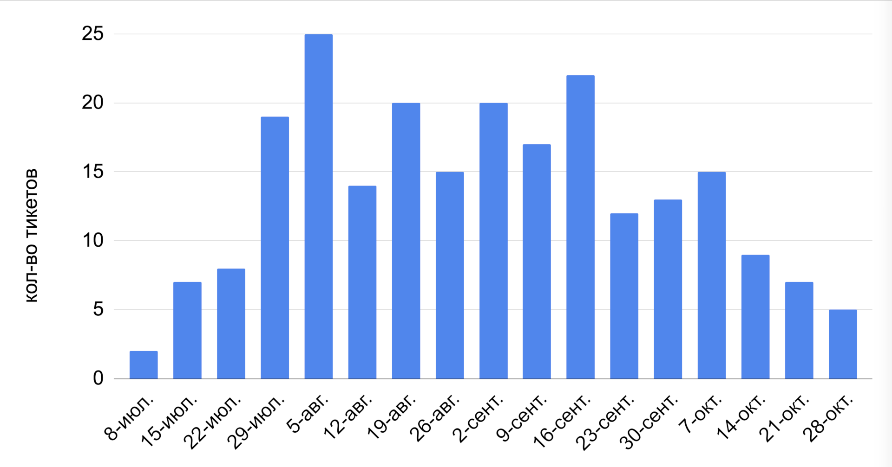

---

layout: yandex2

style: |
    /* собственные стили можно писать здесь!!*/
    .red-alert {
        background: #f73434;
        border-radius: 9px;
        color: white;
        padding: 0 15px 5px;
    }
    
    .active .img-scroll { animation: 60s linear infinite alternate xxx; }
    
    @keyframes xxx { 
      from { transform: translateY(0); } 
      to { transform: translateY(calc(1080px - 100%)); }  
    }

    .column-left {
        margin-top: -30px !important;
    }

    .column-right {
        display: inline-block !important;
        position: absolute !important;
        margin: -30px 0 0 -150px !important;
    }

---

# {:.logo}

## {{ site.presentation.title }}
{:.title}

### {{ site.presentation.service }}



{:.nda}


<div class="authors">

<p>{{ site.author.name }}, {{ site.author.position }}</p>



<p>{{ site.author2.name }}, {{ site.author2.position }}</p>


</div>

## Постановка задачи
{:.section}

## RU
{:.fullscreen}


## EN
{:.fullscreen}


## TR
{:.fullscreen}



## Стандартные инструменты

1. Яндексовая библиотека интернационализации `@yandex‑int/i18n`
1. Проект в tanker.yandex-team.ru
1. `tanker‑kit` для синхронизации с танкером
1. Автоматика для ночной синхронизации

## таймлайн
{:.fullscreen}



## таймлайн
{:.fullscreen}

 

## таймлайн
{:.fullscreen}


## к чему это приводит
{:.fullscreen}



## таймлайн
{:.fullscreen}


## Проблема

- Гарантия, что в интерфейсе есть непереведенные места, равна 99.9%
- Невозможно контролировать переводы конкретных частей функциональности (невозможно контролировать скорость и полноту)

## Что же делать
{:.section}

## В чем дело

1. Фразы лежат в общей куче – не можем контролировать полноту и скорость перевода
1. Работа над переводами начинается после попадания кода в транк

## таймлайн
{:.fullscreen}


## Github diff
{:.fullscreen}


## Arcanum diff
{:.fullscreen}


## Проблема

- специфично для разных vcs
- не поможет отдавать фразы в работу до коммита

## εὕρηκα!
{:.blockquote}

### Архимед

## Tanker API
{:.fullscreen}


## Решение
- выгружать все фразы в ветку в танкере
- получать список фраз как diff между веткой и мастером
- отдавать фразы в работу переводчикам до коммита в git

## Таймлайн
{:.fullscreen}

 

## Новый процесс

1. Разработчик добавляет новые фразы в dev-ветке
1. Когда активная разработка завершена - разработчик выгружает новые фразы в ветку в танкере
1. Получает дифф фраз сравнивая ветку с мастером
1. Создает задачу на перевод изменившихся фраз в ветке
1. Переводчики переводят, тестировщики тестируют
1. Разработчик мержит ветку с переводами и вливает пул-ревест
1. Можно релизить фичу - она уже переведена

## Автоматизируй это
{:.section}

## Москва, весна 2018 года
{:.shout}

## Новый процесс

1. Разработчик добавляет новые фразы в dev-ветке
1. Когда активная разработка завершена - разработчик выгружает новые фразы в ветку в танкере
1. Получает дифф фраз сравнивая ветку с мастером
1. Создает задачу на перевод изменившихся фраз в ветке
1. Переводчики переводят, тестировщики тестируют
1. Разработчик мержит ветку с переводами и вливает пул-ревест
1. Можно релизить фичу - она уже переведена

## Новый процесс

1. Разработчик добавляет новые фразы в dev-ветке
1. Когда активная разработка завершена - <span class="red-alert">разработчик выгружает новые фразы в ветку в танкере</span>
1. <span class="red-alert">Получает дифф фраз сравнивая ветку с мастером</span>
1. <span class="red-alert">Создает задачу на перевод изменившихся фраз в ветке</span>
1. Переводчики переводят, тестировщики тестируют
1. Разработчик <span class="red-alert">обновляет переводы в своей ветке</span>
1. Разработчик <span class="red-alert">мержит ветку с переводами</span> и вливает пул-ревест
1. Можно релизить фичу - она уже переведена

## Что нам нужно сделать

1. Научить tanker-kit выгружать в ветки
1. API для работы с ветками танкера
1. Автоматизировать тикеты в трекере

## [tanker-kit](https://github.yandex-team.ru/search-interfaces/frontend/tree/master/packages/tanker-kit)
{:.shout}

## [tanker-branch](https://github.yandex-team.ru/twilight/tanker-branch)
{:.shout}

## tanker-branch
{:.fullscreen}
```bash
- Создать ветку из ветки br2
$ tanker-branch create br1 br2

- Удалить ветку
$ tanker-branch rm br1

- Разница между ветками
$ tanker-branch diff br1 br2

- Слияние веток (b1 => b2)
$ tanker-branch merge br1 br2

- Слияние веток (b1 => b2) после решения конфликтов в resolve.json
$ tanker-branch merge br1 br2 -r ./resolve.json
```

## Si vis pacem, para bellum
{:.blockquote}

### Гай Юлий Цезарь

## Конфликты

```bash
$ tanker-branch merge master branch
```

## Конфликты

```bash
$ tanker-branch merge master branch
{
    "dna:declarations_filter/today-is/ru": {
        "form": {
            "a": "пЯтьница",
            "b": "Кровавый четверг",
            "resolved": null
        },
        "hash": "ea08bc....7bc77d3"
    }
}
```

## Конфликты

```bash
$ tanker-branch merge master branch
{
    "dna:declarations_filter/today-is/ru": {
        "form": {
            "a": "пЯтьница",
            "b": "Кровавый четверг",
            "resolved": null
        },
        "hash": "ea08bc....7bc77d3"
    }
}
$ tanker-branch merge master branch -r ./conflicts.json
```

## व्यायाम भी शरीर के लिए उतना ही आवश्यक है जितना ही हवा, पानी और भोजन।
{:.blockquote}

### Мохандас Карамчанд (Махатма) Ганди

## [tanker-gandhi](https://github.yandex-team.ru/twilight/tanker-gandhi)
{:.shout}

## tanker-gandhi
{:.fullscreen}


## tanker-gandhi
{:.fullscreen}


## tanker-gandhi
{:.fullscreen}


## tanker-gandhi
{:.fullscreen}


## Конфликты

```bash
$ tanker-branch merge master branch > conflicts.json
$ tanker-ghandi ./conflicts.json
```

## Конфликты

```bash
$ tanker-branch merge master branch > conflicts.json
$ tanker-ghandi ./conflicts.json
$ tanker-branch merge master branch -r conflicts.json
```

## [auto-issues](https://github.yandex-team.ru/twilight/auto-issues)
{:.shout}

## tanker-sync?
- push
- pull
- merge

## tanker-sync?
<div>
    <div class="image-left column-left">
        <ul>
            <li><b>push</b></li>
            <li>pull</li>
            <li>merge</li>
        </ul>
    </div>
    <div class="image-right column-right">
        <ol>
            <li>find tanker branch</li>
            <li>master -> branch</li>
            <li>upload phrases</li>
            <li>diff master..branch</li>
            <li>find or create startrek issue</li>
            <li>update issue</li>
        </ol>
    </div>
</div>

## tanker-sync?
<div>
    <div class="image-left column-left">
        <ul>
            <li>push</li>
            <li><b>pull</b></li>
            <li>merge</li>
        </ul>
    </div>
    <div class="image-right column-right">
        <ol>
            <li>find tanker branch</li>
            <li>master -> branch</li>
            <li>download phrases</li>
        </ol>
    </div>
</div>

## tanker-sync?
<div>
    <div class="image-left column-left">
        <ul>
            <li>push</li>
            <li>pull</li>
            <li><b>merge</b></li>
        </ul>
    </div>
    <div class="image-right column-right">
        <ol>
            <li>find tanker branch</li>
            <li>master -> branch</li>
            <li>branch -> master</li>
            <li>find startrek issue</li>
            <li>mark issue as committed</li>
        </ol>
    </div>
</div>

## Итоги
{:.section}

## Что получилось

1. {:.next}придумали процесс
1. {:.next}разработали инструменты
1. {:.next}запустили 


## Статистика 1
{:.fullscreen}


## Статистика 2
{:.fullscreen}


## Что хочется улучшить

- увеличить степень автоматизации
- вынести все в единый реиспользуемый пакет
- научиться считать статистику
- больше общаться с переводчиками

## Спасибо!
{:.contacts}



<figure markdown="1">

### {{ site.author.name }}


{{ site.author.position }}


</figure>





<figure markdown="1">

### {{ site.author2.name }}


{{ site.author2.position }}


</figure>



<!-- разделитель контактов -->
-------

<!-- left -->
- {:.mail}aleks-konst@yandex-team.ru

<!-- right -->

<!-- 

- {:.mail}author@yandex-team.ru
- {:.phone}+7-999-888-7766
- {:.github}author
- {:.bitbucket}author
- {:.twitter}@author
- {:.telegram}author
- {:.skype}author
- {:.instagram}author
- {:.facebook}author
- {:.vk}@author
- {:.ok}@author

-->
